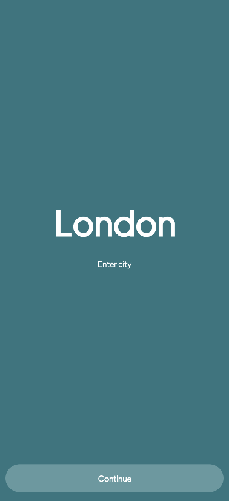
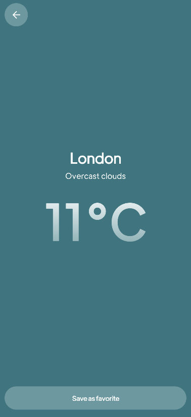

# Project Title

This project is a cross-platform mobile application developed for both Android and iOS platforms. 

## Technologies Used

For the Android version, I used [Jetpack Compose](https://developer.android.com/jetpack/compose), a modern UI toolkit designed to help developers quickly and easily build beautiful UIs for all Android apps. 

For the iOS version, I used [Storyboard](https://developer.apple.com/library/archive/documentation/ToolsLanguages/Conceptual/Xcode_Overview/DesigningwithStoryboards.html), a visual tool for laying out multiple application views and the transitions between them.

## Architecture

Both versions of the project follow the Model-View-ViewModel (MVVM) architectural pattern, which allows for a separation of concerns, and makes the codebase easier to manage and test.

I also adhered to the SOLID principles to ensure that the code is easy to understand, maintain, and expand upon.

## Screenshots

Here are some screenshots application:

